# Homework unit two:

## Description of the homework:

In this homework, I created my profile using the homeworks and miniprojects from the Bootcamp that I have doone so far. The layout of the page and some of the functions used are based from activity and previous homeworks done.

The page displays an area in header with link to areas of the page. the area AboutMe, has a small description of mysleft. The Works area has the links to the homeworks and miniprojects done in class so far. There is an area for the 3 projects that will be done in class, as of now there is a placeholder to change it later once the projects are done. there is ContcatMe section with hyperlinks to my LinkedIn, my GitHub and email address.

### Link to application [HERE](https://marymd98.github.io/Unit2-Homework/)

## Screenshot  of line of code:
Below are screenshots of the html and css code

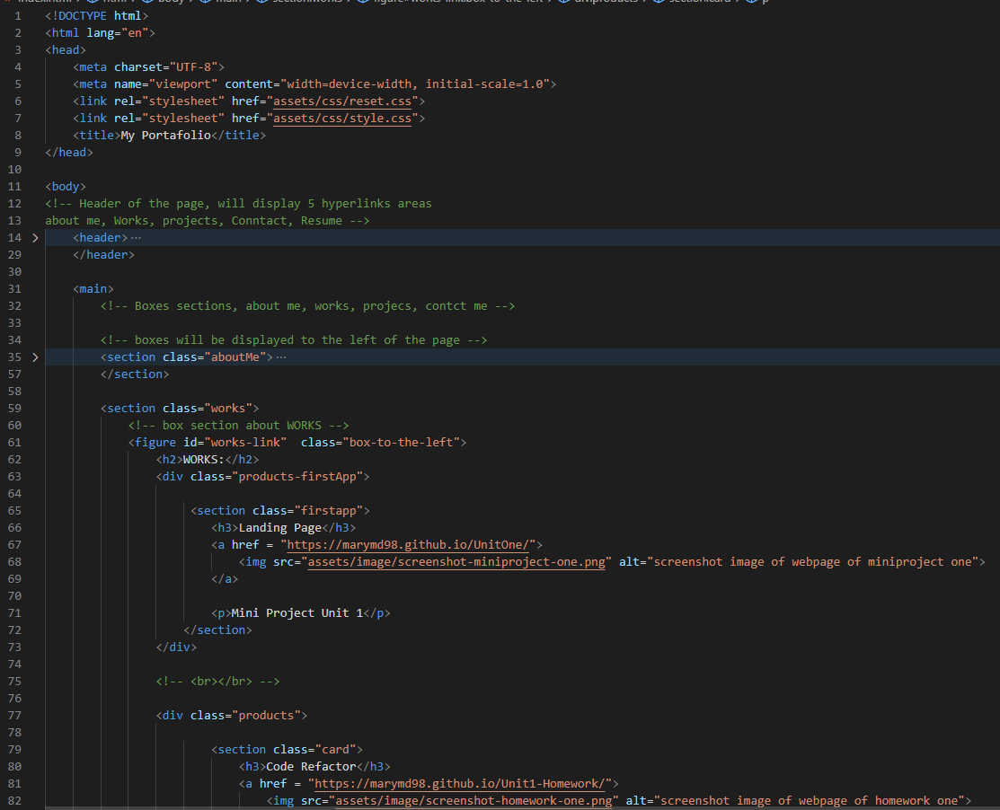
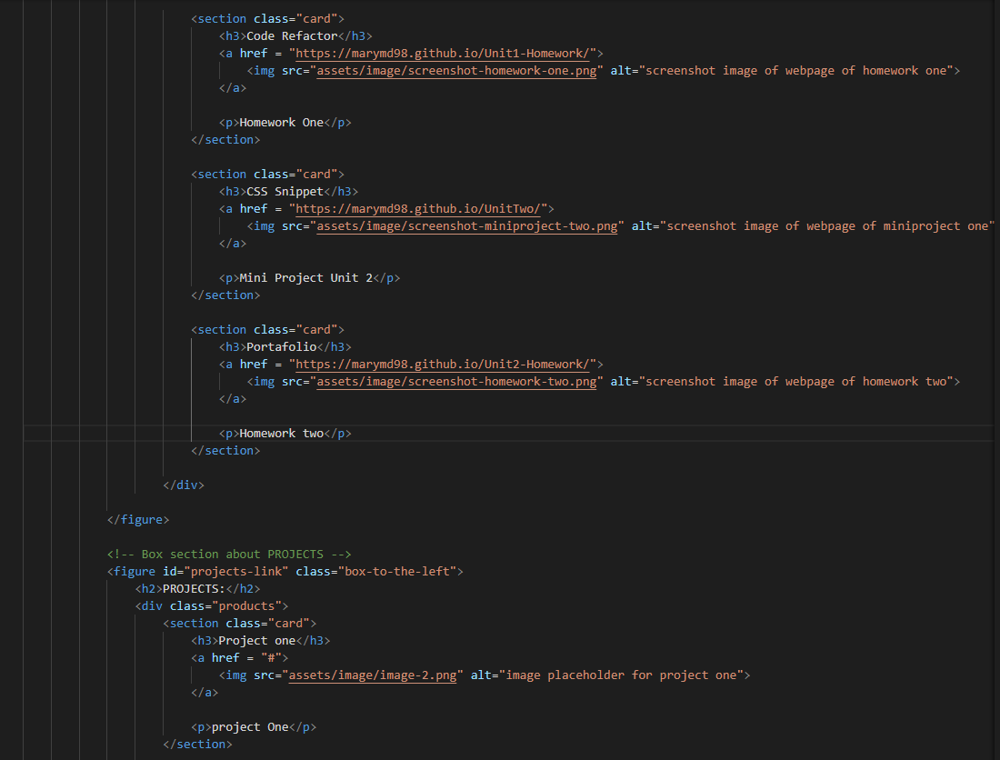
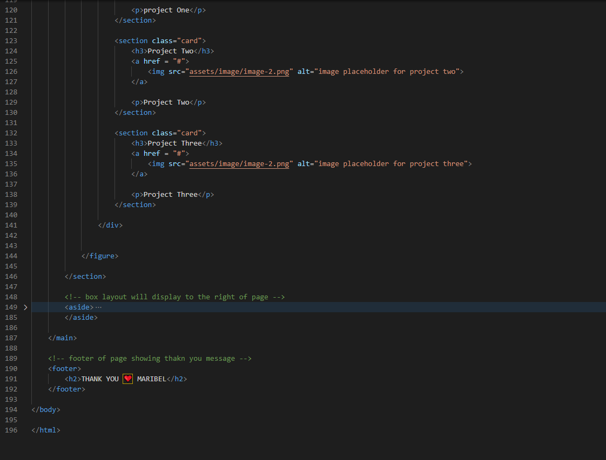

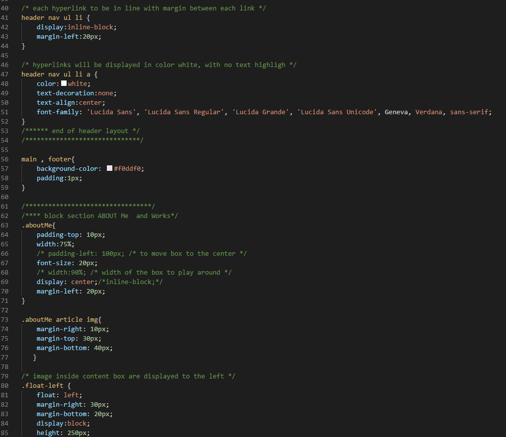
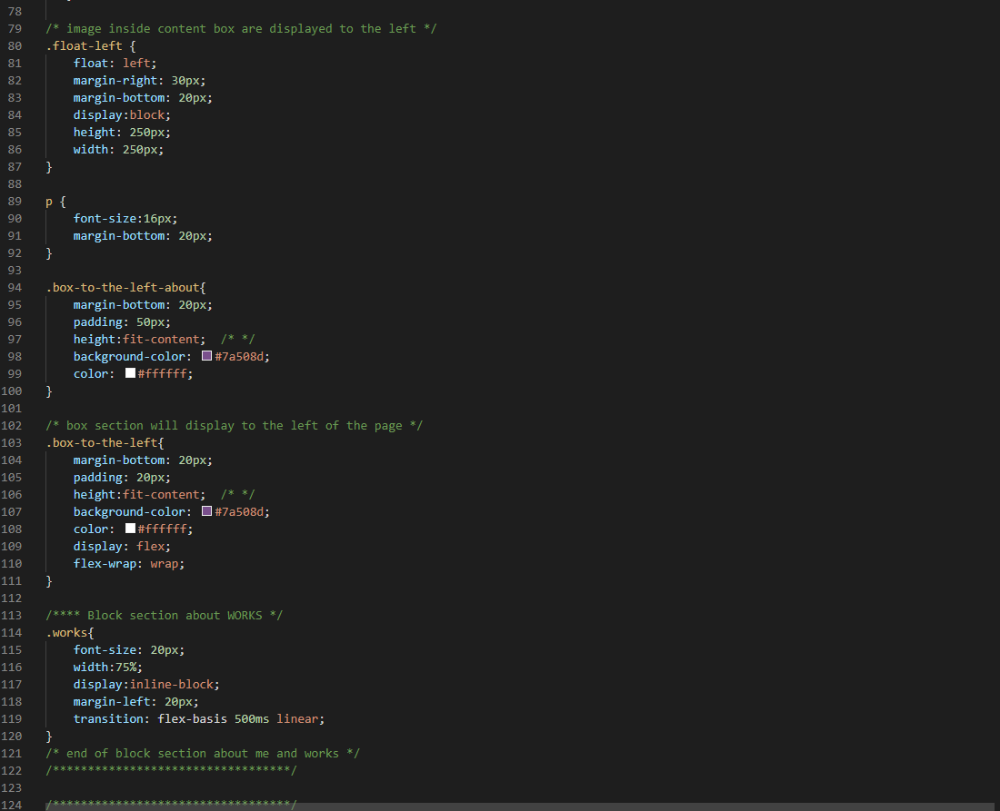
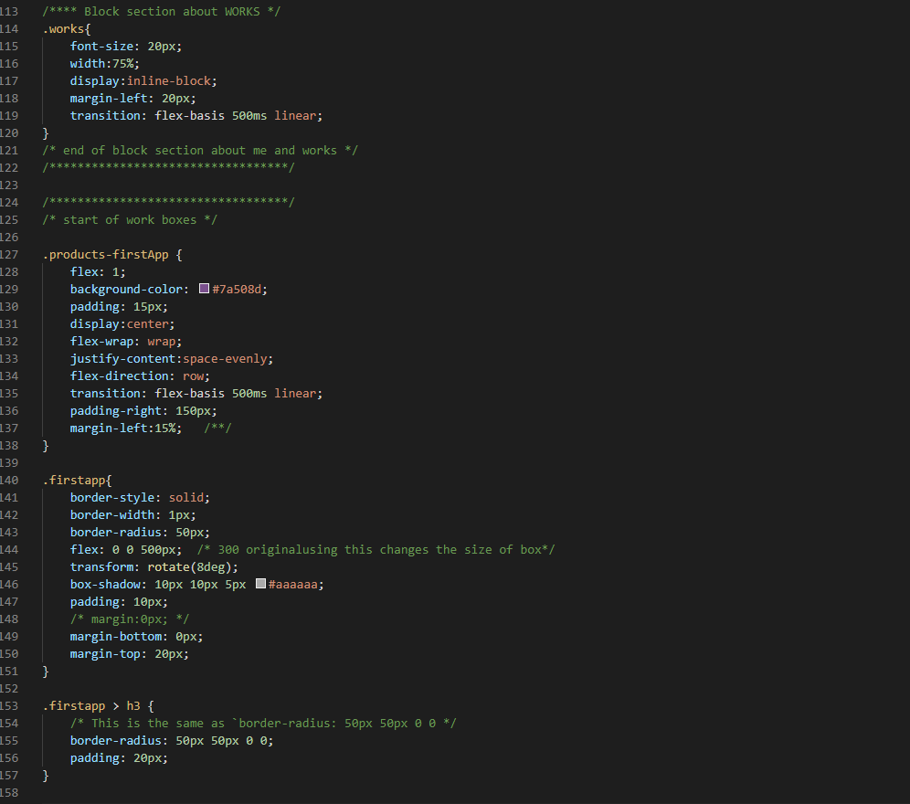
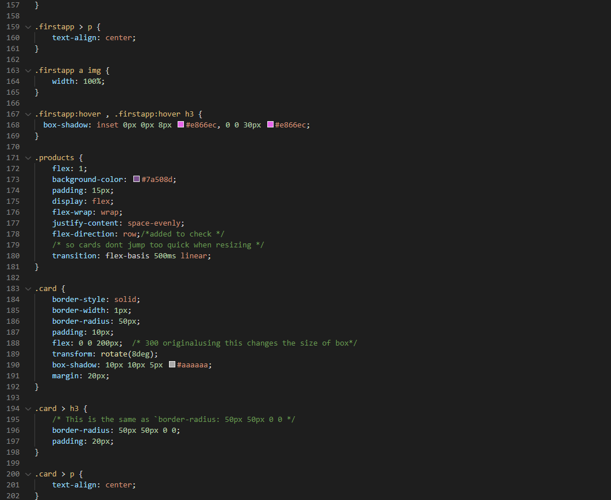
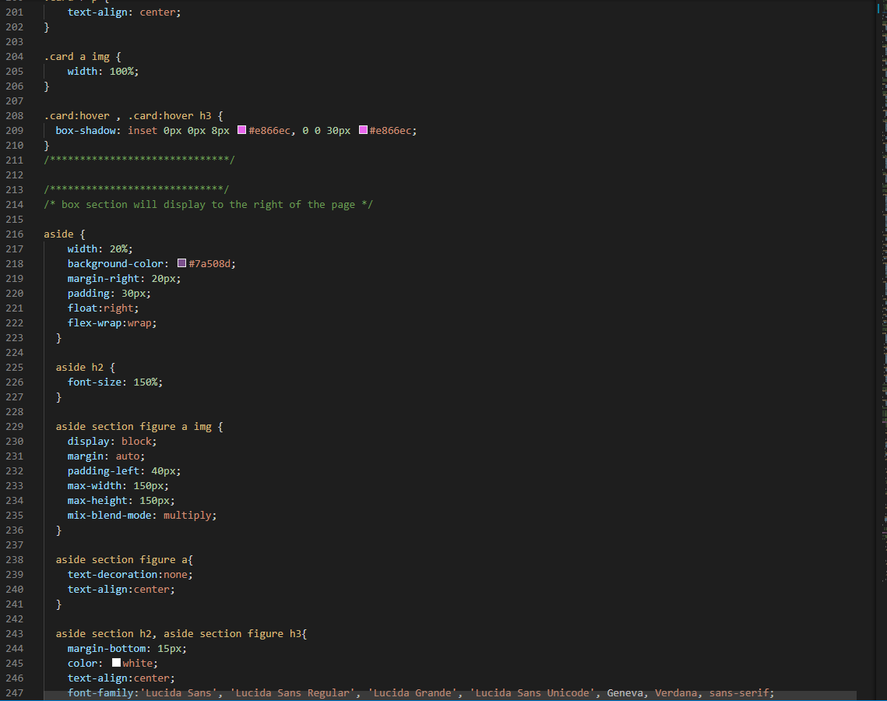
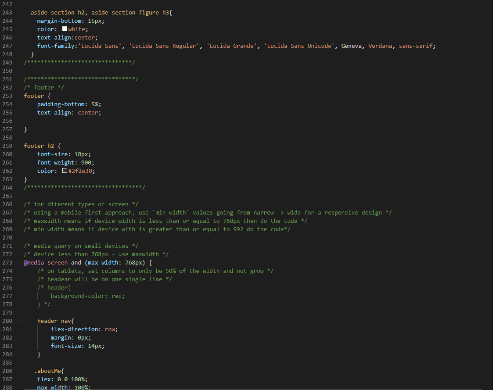
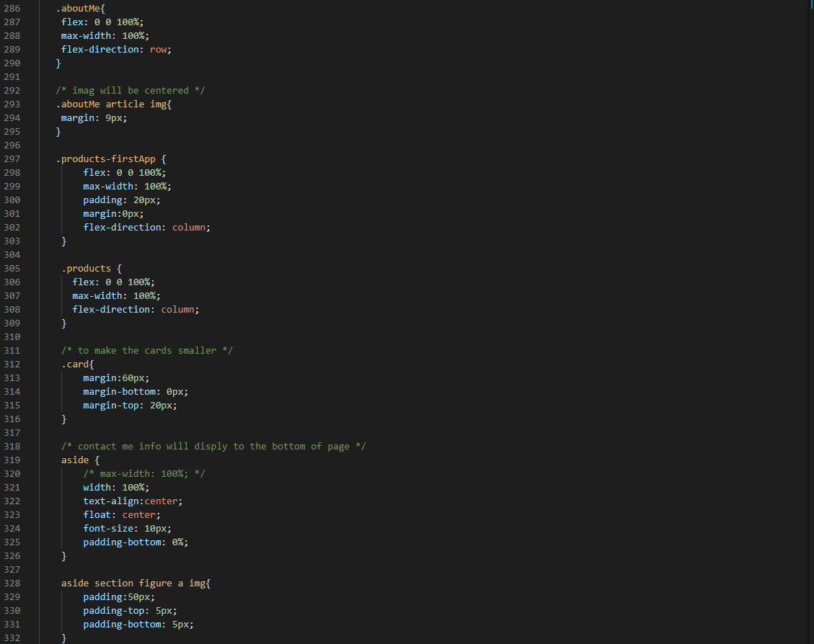
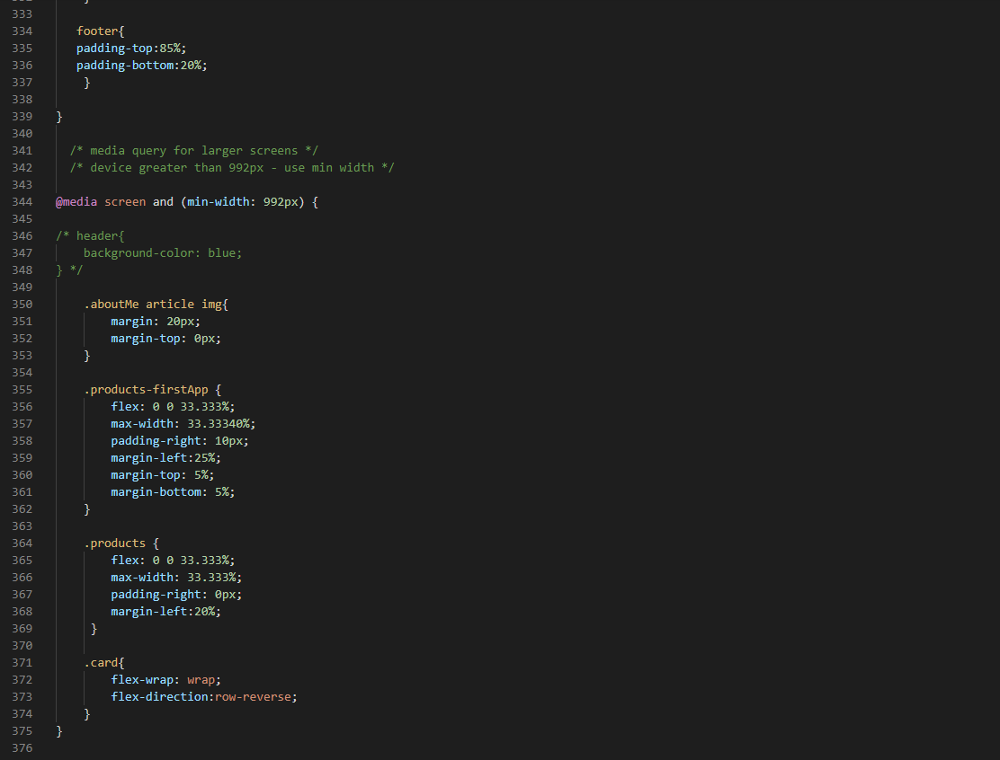
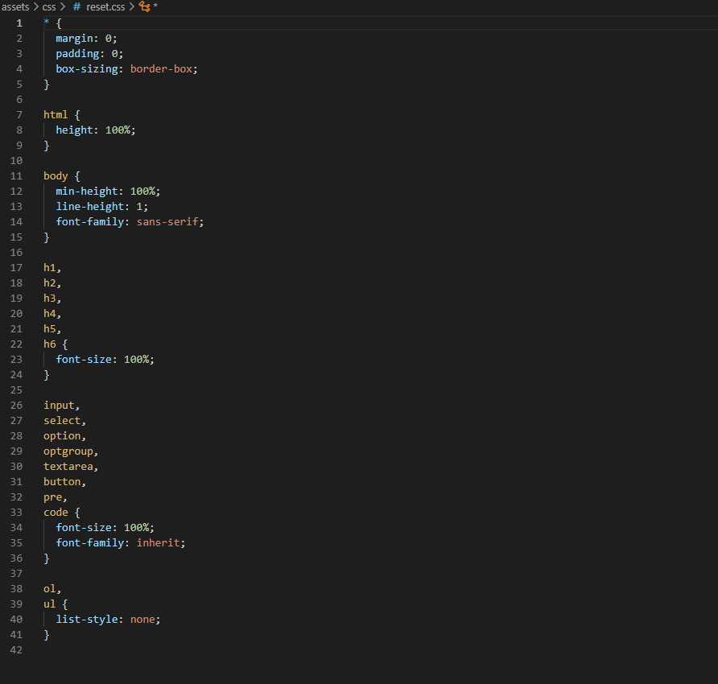

